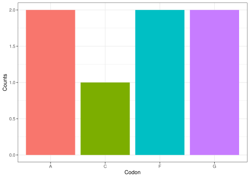

<!-- README.md is generated from README.Rmd. Please edit that file -->

# Overview

**`BioSeqR`** is a package equipped with a suite of functions designed
for the management and analysis of DNA, RNA, and Protein sequence data.

# Usage

## `transcribe()`

The **`transcribe()`** function accepts a DNA sequence of any length as
a parameter, and transcribes it, i.e, it returns the corresponding RNA
sequence for the input DNA sequence.

``` r
library(Group.5.Dogma)  
#> 
#> Attaching package: 'Group.5.Dogma'
#> The following object is masked from 'package:base':
#> 
#>     replicate

RNA <- transcribe("ATGCCGCGTAATAATCCCGTACCA") 
RNA 
#> [1] "AUGCCGCGUAAUAAUCCCGUACCA"
```

## `get_codons()`

The **`get_codons()`** function accepts a DNA or RNA sequence and its
reading frame’s starting position as inputs, with a default starting
position of 1. It returns a list of protein codons, each consisting of
three nucleotides. If the sequence length isn’t a multiple of three, the
final one or two nucleotides are omitted.

``` r
library(Group.5.Dogma)  

codons <- get_codons("ACTGGACCATCG") 
codons 
#> [1] "ACT" "GGA" "CCA" "TCG"
```

``` r
library(Group.5.Dogma) 

codons <- get_codons("UUACGAUUUU") 
codons
#> [1] "UUA" "CGA" "UUU"
```

## `col_plot()`

The **`col_plot()`** function accepts a sequence of amino acid as an
input and will return a column plot representing the count of each amino
acid in the sequence. It can also be use with RNA or DNA sequence to
show the count of each nucleotide.

``` r

col_plot("ACFGAGF")
```



## Usage of BioSeqR

The five functions can be collectively employed to determine the amino
acid count of a DNA sequence generated at random. It is possible to use
the fucntions progressively to generate a DNA sequence of any length,
generate the corresponding RNA transcript, fetch the codons from the RNA
sequence, translate the codons into amino acids, and then find the
number of occurences of each amino acid in the generated peptide
sequence. Thus, the package covers the entirety of the Central Dogma of
Molecular Biology.

``` r
#seq_len <- 9 
#DNA_seq <- replicate(seq_len) 
#RNA_seq <- transcribe(DNA_seq) 
#codons <- get_codons(RNA_seq)  

# Please insert the name of your function here Adomas and uncomment the code  

#peptide_seq <- function_4(codons)  
#aa_count_plot <- col_plot(peptide_seq) 
#aa_count_plot
```

# Further Function Implementation

**`BioSeqR`** is designed for managing and analyzing biological sequence
data. While our current functions offer a robust set of tools, there are
potential enhancements we could consider. For instance, we might
implement a function to obtain the reverse complement of a DNA/RNA
sequence or introduce a function to address post-transcriptional
modifications, especially when inputting mRNA sequences into
**`get_codons()`**. Thus, the package can be further augmented to be an
exhaustive resource for Molecular Biology analysis.

Regarding dependencies, our package leverages functions from the
**`ggplot2`** and **`stringr`** packages. It is a good idea to limit the
number of dependencies, as excessive reliance on external packages can
cause problems for the users, by requiring them to download many
additional packages. In BioSeqR, we employ both
**`@importFrom package function`** and **`package::function()`** to
manage dependencies. The **`@importFrom`** specifically imports the
designated function, reducing potential namespace conflicts. On the
other hand, using **`package::function()`** avoids the need for updating
roxygen2 comments or the **`NAMESPACE`** file for individual functions.
This approach also enhances code clarity, as it directly indicates the
origin of each imported function.
